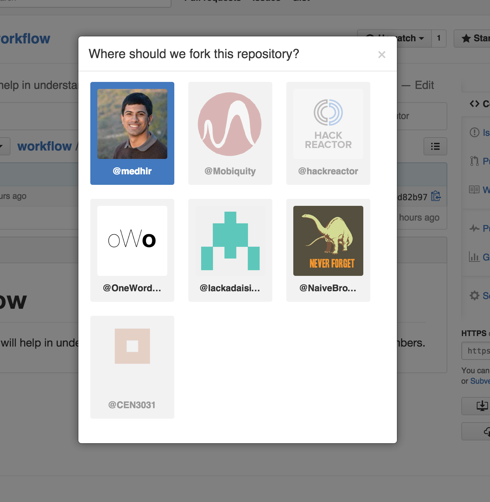

# workflow
This assignment will help in understanding how to use Github to collaborate with your team members. 

## Common Git Commands + Using Git

**Git** is the version control software we will be using to keep track of changes made to your web application. There are GUI interfaces available to work with git, but you will benefit greatly as a software developer by learning how to use command line tools to accomplish tasks. These are a few commands that will allow you to effectively use git to version control your project: 

### Making Commits
A "commit" is a record that creates a snapshot of your code, which is added to your repository's history. In order to create this snapshot, you must first *stage* the files you want to include in the snapshot. Once you have staged the files, you must physically create the snapshot within your project's history by making a *commit*.

- `git status` : Tells you which files you've modified/added, and which files are staged for a commit
- `git diff`: Shows you the changes you have made (line insertions and line deletions) by file
- `git add <filename>` : Allows you to stage a file in order to commit it
- `git add .`: Adds all files to staging 
- `git commit -m <message>` : This creates the commit (you must specify a message with every commit you make)

###Branching 

Branching allows you to experiment with changes to your code base without impacting the working version. 

- `git branch <branch_name>`: Creates a new branch
- `git checkout <branch_name>`: Switch between branches
- `git checkout -b <branch_name>`: A shortcut that creates a new branch, then switches to it

## Forking the repository 

Each team must create changes to their own version of this repository. In order to accomplish this, it is necessary to **fork** the repository. **Forking** creates a copy of the repository that you can then make changes to without changing the original. In order to accomplish this: 

1. Click the 'fork' button

2. Choose the location for your fork (this should be your team's organization)

