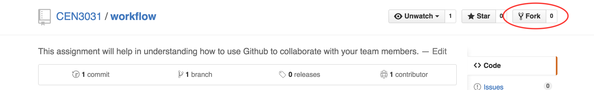
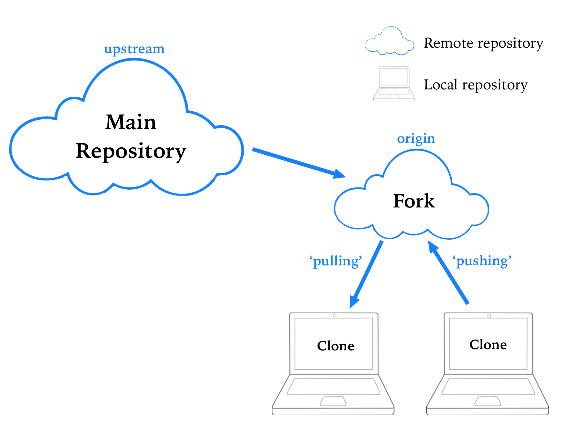
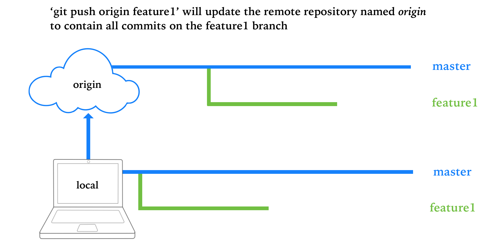
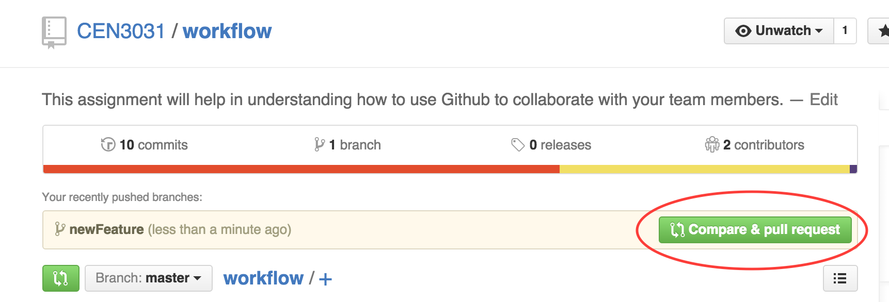
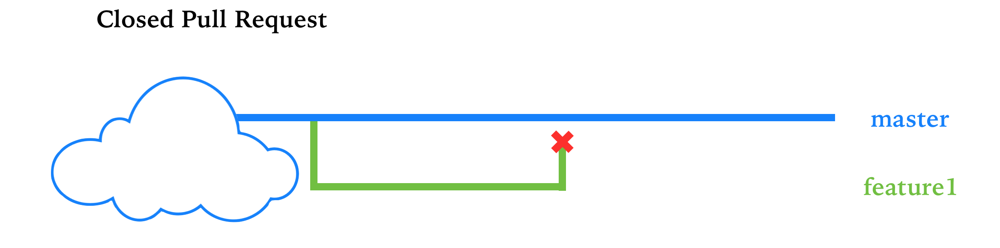

# workflow
This assignment will help in understanding how to use GitHub to collaborate with your team members. 

* [Common Git Commands](#common-git-commands)
  * [Making Commits](#making-commits)
  * [Branching](#branching)
* [Remote repositories](#remote-repositories)
* [Forking the repository](#forking-the-repository)
* [Collaborating with GitHub](#collaborating-with-github)
* [Assignment](#assignment)


## Common Git Commands

**Git** is the version control software we will be using to keep track of changes made to your web application. There are GUI interfaces available to work with git, but you will benefit greatly as a software developer by learning how to use command line tools to accomplish tasks. These are a few commands that will allow you to effectively use git to version control your project.  

### Making Commits
A "commit" is a record that creates a snapshot of your code, which is added to your repository's history. In order to create this snapshot, you must first *stage* the files you want to include in the snapshot. Once you have staged the files, you must physically create the snapshot within your project's history by making a *commit*.

- To see which files you've modified/added/deleted, and which changes are *staged* to be commited, use `git status`
- To view the changes you've made to each file use `git diff`
- `git add <file_name>` will add the file you specify to *staging*
- To stage all files you've changed, use `git add .`
- To create a new commit with all the files you have staged, type `git commit -m <message>`
- `git hist` will show you a history of all the commits you have added to your repository

### Branching 

Branching allows you to experiment with changes to your code base without impacting the working version. Your main branch is usually referred to as **master**. When you commit changes to a branch, they will not be reflected in other branches, unless you **merge** the changes. 

To see the branch you are currently working on, use `git status`.

- `git branch <branch_name>` creates a new branch
- To move to a different branch, use `git checkout <branch_name>`
- `git checkout -b <branch_name>` is a shortcut that creates a new branch, then switches to it
- `git merge <branch_name>` will merge changes from the branch you specify into the branch you are currently working on

## Remote repositories
**Remote repositories** refer to repositories stored in a different location. In our case, the remote repositories are stored on GitHub. 

You can add a remote repository to your local machine with the command 

```
git remote add <remote_name> <remote_uri>
```

`git remote` will provide you the names of remote versions of the repository that exist on your local machine. 

Once you've made changes to your code and commited the results, you may want to add those changes to your repository on GitHub. We can **push** the local changes to a remote repository with the command 

```
git push <remote_name> <branch_name>
```

Say your team members have made contributions to the codebase and have pushed those changes to GitHub. In order to get those changes on your local repository, you must **pull** changes from a remote repository using  

```
git pull <remote_name> <branch_name>
```

If you have used `git push origin master` or `git pull origin master`, this refers to pushing/pulling changes from a remote repository named *origin* into the *master* branch. 

## Forking the repository 

Each team must create changes to their own version of this repository. In order to accomplish this, it is necessary to **fork** the repository. **Forking** creates a copy of the repository on your GitHub account/organization that you can modify through your own commits. In order to accomplish this: 



1. Click the 'fork' button
2. Choose the location for your fork (this should be your team's organization)
3. Copy the repository onto your local machine, using `git clone <remote_repository_uri>`



## Collaborating with GitHub

The **scrum master** is responsible for enforcing the use of a workflow when contributing to a code base. This workflow will minimize the chances of making changes to the same lines of code, causing **merge conflicts**.

**Merge conflicts** result when 2 different branches have changed the same line number in a file. Learn more about how to fix merge conflicts [here](https://help.github.com/articles/resolving-a-merge-conflict-from-the-command-line/).

- For each task in a user story, you should create a feature branch with a name that describes what you are working on. 
- Commit your changes to this branch
- **Before pushing your branch to GitHub** make sure to update your code to reflect any changes made by team members using `git pull origin master`, which will pull changes from the *master* branch into your *feature* branch
- Push your branch to GitHub, which allows you to: 
    - make a pull request to merge the code into another branch
    - allow other team members to commit code to your branch



- When you are done with a feature, create a pull request



The **master** branch should be used to describe the working/deployable version of your code. All completed features will be merged into your master branch. 

The **scrum master** ultimately merges the pull request into the master branch. All team members should be responsible for reviewing code in a pull request before it gets merged. If the code in a pull request needs to be modified before being merged, the pull request should be **closed**. A new pull request should be made to reflect changes made to the feature. 



## Assignment
[This document](collaborating.pdf) provides details on Scrum fundamentals, as well as individual tasks for your team to complete.

You will be demonstrating your knowledge of GitHub workflow and Scrum fundamentals in this assignment. You will be making simple changes to the sample to-do app that was shown in discussions and lecture. The Scrum Master will assign these tickets/tasks to the team. **All** members of the team must complete 1 ticket/task. There may be more tasks than you have group members, in that case it is **fine** to not do a task. Just make sure that every team member does one task.

####Tasks/tickets
######Accomplish these tasks in whatever way you see fit. No limitatons.

1. Change the background color of the to-do app
2. Give the option to assign a priority to a to-do item  
 - For example: ["Now", "Tomorrow", "Someday"]
3. Add an "edit" button with appropiate functionality
4. Add a button to mark an item as "complete"    
 - this should signify that the item is complete somehow, but not delete it.   
 - You can do this by striking out the text or whatever other way you see fit.   
5. Show the total number of items in the to-do list at above the list.  
 - This number should change when items are added / deleted (duh).
6. A button to clear all "completed" tasks

#####In order to complete these tasks, you will need to:

1. Create a GitHub organization for your team. Fork this repository to that organization. 
2. You will not need to use Pivotal Tracker to track your tasks/user stories/tickets for this assignment.
2. Follow the timeline and tasks described [here](collaborating.pdf).
3. Make sure to follow the workflow. Create a new branch for each task, and make pull requests to merge changes into your code base. 
4. At the end, your forked version of this repo should have had 5/6 (or more) completed pull requests to merge branches for each feature update into the master branch.   
 - Your repo's master branch should have the updated code (in the todo-src directory) to reflect each task/ticket.

Have fun! :sunglasses: :+1:
